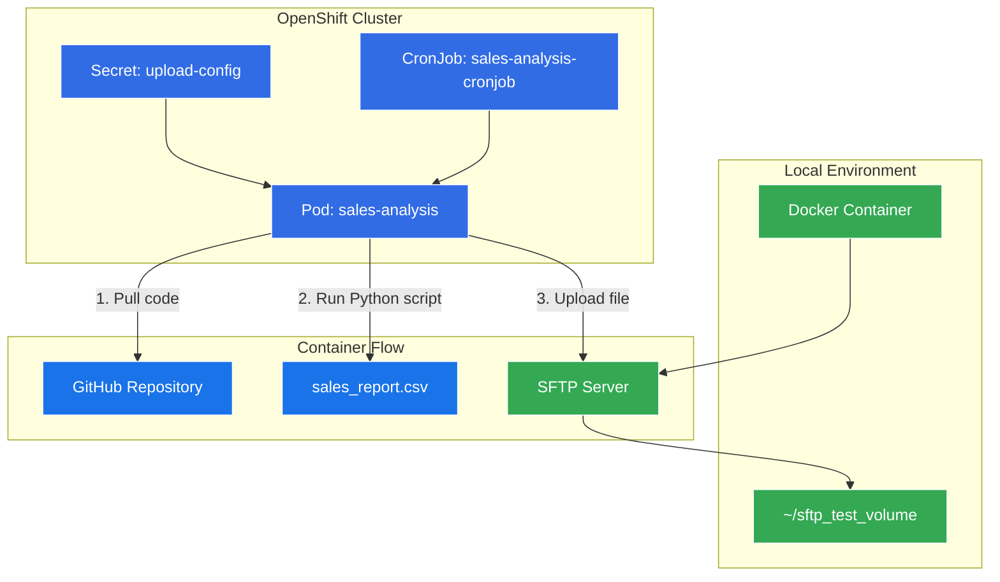
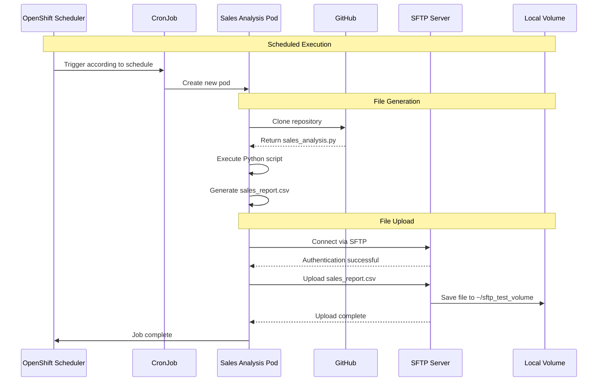
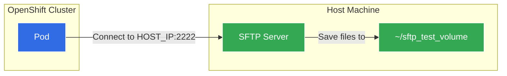
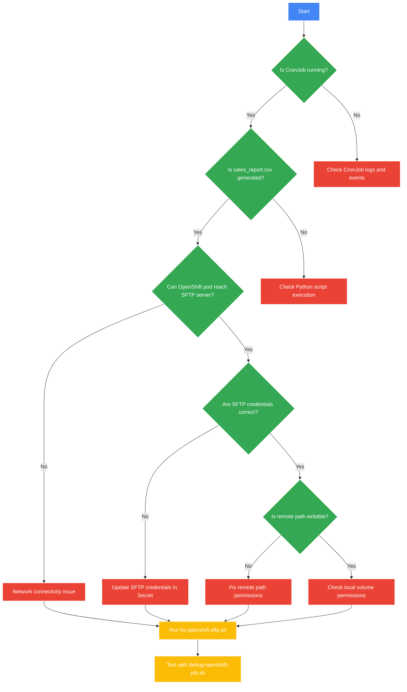

# Sales Analysis CronJob Architecture

## System Architecture

```mermaid
graph TD
    subgraph "OpenShift Cluster"
        CJ[CronJob: sales-analysis-cronjob] --> POD[Pod: sales-analysis]
        SECRET[Secret: upload-config] --> POD
    end
    
    subgraph "Container Flow"
        POD --> |1. Pull code| GITHUB[GitHub Repository]
        POD --> |2. Run Python script| CSV[sales_report.csv]
        POD --> |3. Upload file| SFTP[SFTP Server]
    end
    
    subgraph "Local Environment"
        SFTP --> VOLUME[~/sftp_test_volume]
        DOCKER[Docker Container] --> SFTP
    end
    
    classDef openshift fill:#326ce5,stroke:#fff,stroke-width:1px,color:#fff
    classDef container fill:#1a73e8,stroke:#fff,stroke-width:1px,color:#fff
    classDef local fill:#34a853,stroke:#fff,stroke-width:1px,color:#fff
    
    class CJ,POD,SECRET openshift
    class GITHUB,CSV container
    class SFTP,VOLUME,DOCKER local
```

## Process Sequence

```mermaid
sequenceDiagram
    participant OS as OpenShift Scheduler
    participant CJ as CronJob
    participant Pod as Sales Analysis Pod
    participant GH as GitHub
    participant SFTP as SFTP Server
    participant Vol as Local Volume
    
    Note over OS,Vol: Scheduled Execution
    OS->>CJ: Trigger according to schedule
    CJ->>Pod: Create new pod
    
    Note over Pod,Vol: File Generation
    Pod->>GH: Clone repository
    GH-->>Pod: Return sales_analysis.py
    Pod->>Pod: Execute Python script
    Pod->>Pod: Generate sales_report.csv
    
    Note over Pod,Vol: File Upload
    Pod->>SFTP: Connect via SFTP
    SFTP-->>Pod: Authentication successful
    Pod->>SFTP: Upload sales_report.csv
    SFTP->>Vol: Save file to ~/sftp_test_volume
    SFTP-->>Pod: Upload complete
    Pod->>OS: Job complete
```

## Network Connectivity

```mermaid
graph LR
    subgraph "OpenShift Cluster"
        POD[Pod]
    end
    
    subgraph "Host Machine"
        SFTP[SFTP Server]
        VOLUME[~/sftp_test_volume]
    end
    
    POD -->|Connect to HOST_IP:2222| SFTP
    SFTP -->|Save files to| VOLUME
    
    classDef openshift fill:#326ce5,stroke:#fff,stroke-width:1px,color:#fff
    classDef local fill:#34a853,stroke:#fff,stroke-width:1px,color:#fff
    
    class POD openshift
    class SFTP,VOLUME local
```

## Troubleshooting Process

```mermaid
flowchart TD
    A[Start] --> B{Is CronJob running?}
    B -->|Yes| C{Is sales_report.csv generated?}
    B -->|No| B1[Check CronJob logs and events]
    
    C -->|Yes| D{Can OpenShift pod reach SFTP server?}
    C -->|No| C1[Check Python script execution]
    
    D -->|Yes| E{Are SFTP credentials correct?}
    D -->|No| D1[Network connectivity issue]
    
    E -->|Yes| F{Is remote path writable?}
    E -->|No| E1[Update SFTP credentials in Secret]
    
    F -->|Yes| G[Check local volume permissions]
    F -->|No| F1[Fix remote path permissions]
    
    D1 --> H[Run fix-openshift-sftp.sh]
    E1 --> H
    F1 --> H
    G --> H
    
    H --> I[Test with debug-openshift-job.sh]
    
    classDef start fill:#4285f4,stroke:#fff,stroke-width:1px,color:#fff
    classDef process fill:#34a853,stroke:#fff,stroke-width:1px,color:#fff
    classDef issue fill:#ea4335,stroke:#fff,stroke-width:1px,color:#fff
    classDef solution fill:#fbbc05,stroke:#fff,stroke-width:1px,color:#fff
    
    class A start
    class B,C,D,E,F process
    class B1,C1,D1,E1,F1,G issue
    class H,I solution
``` 