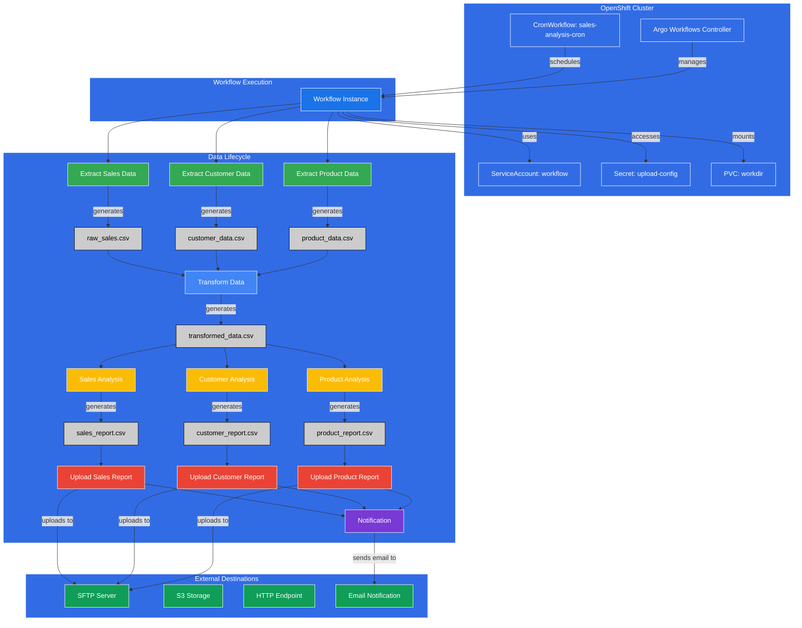
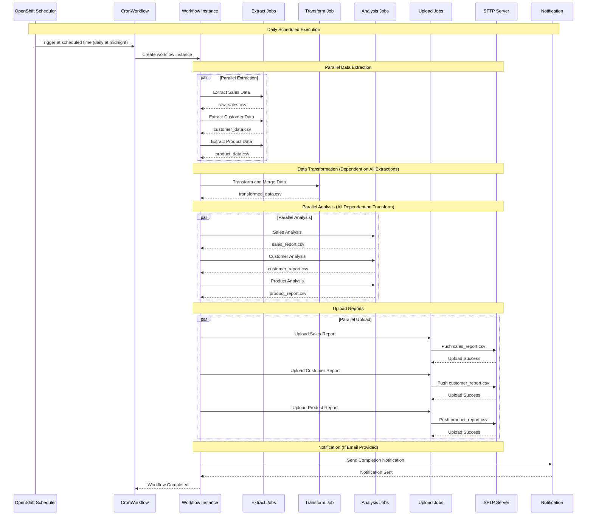
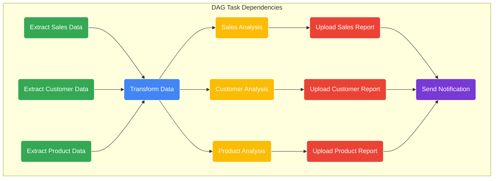
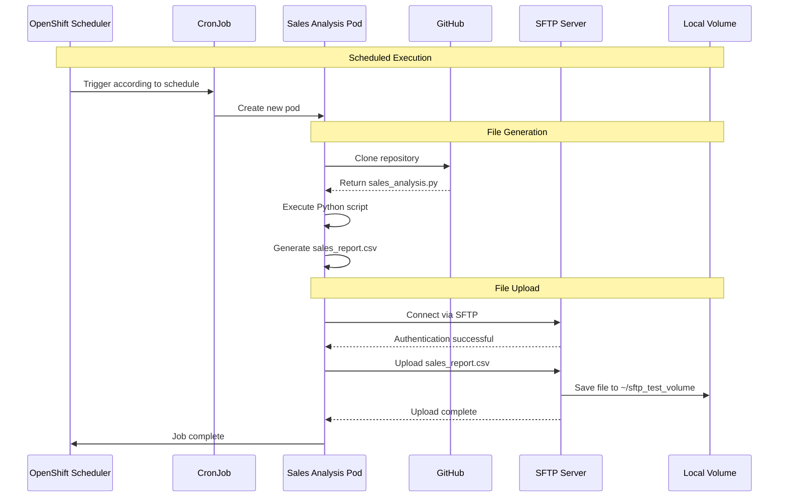
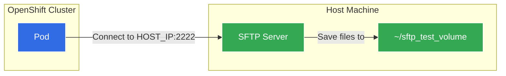
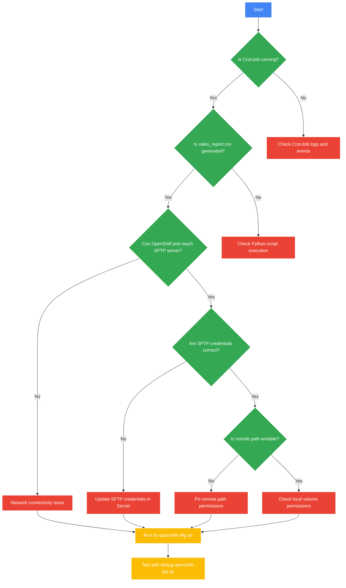

# Sales Analysis CronJob Architecture

## System Architecture with Argo Workflows

## Workflow Execution Sequence

## Job Dependencies Graph

## Process Sequence

## Network Connectivity

## Troubleshooting Process

