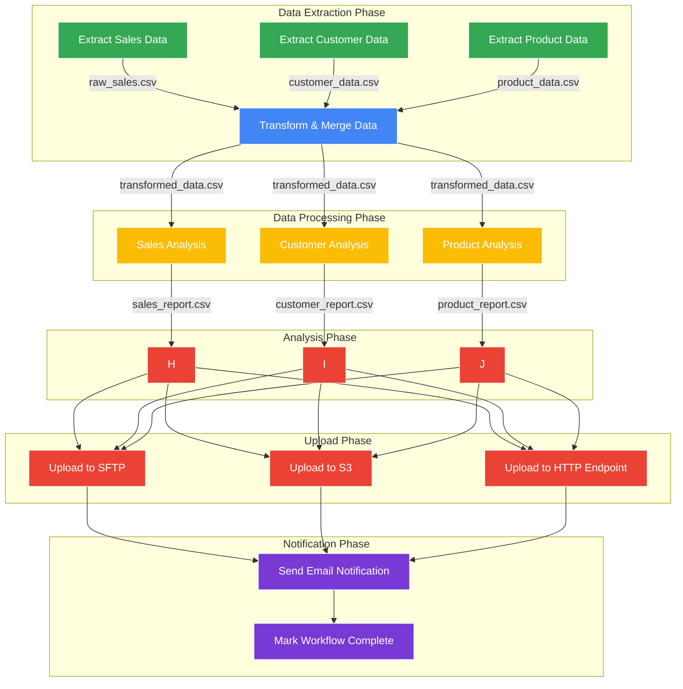

# Orchestrating Python Jobs with Argo Workflows

This guide explains how to enhance the sales analysis project with Argo Workflows to orchestrate multiple Python jobs with dependencies.

## Overview

Argo Workflows allows you to:
- Define complex job dependencies
- Run jobs in parallel when possible
- Visualize the entire workflow
- Handle retries and errors gracefully
- Share data between steps

## Setup Argo Workflows in OpenShift

1. Install Argo Workflows:

```bash
# Login to your OpenShift cluster
oc login <your-cluster>

# Create a project for Argo
oc new-project argo

# Get the latest Argo Workflows version
ARGO_VERSION=$(curl --silent "https://api.github.com/repos/argoproj/argo-workflows/releases/latest" | grep '"tag_name"' | sed -E 's/.*"([^"]+)".*/\1/')
echo "Installing Argo Workflows version: $ARGO_VERSION"

# Install Argo Workflows using the versioned installation manifest
oc apply -n argo -f https://github.com/argoproj/argo-workflows/releases/download/$ARGO_VERSION/install.yaml

# Or use a specific version if needed:
# oc apply -n argo -f https://github.com/argoproj/argo-workflows/releases/download/v3.4.8/install.yaml

# Set up permissions (OPTIONAL for local PoC - use simple-argo-fix.sh instead)
# For production environments, you may need these additional permissions:
# oc adm policy add-role-to-user admin system:serviceaccount:argo:argo
# oc adm policy add-role-to-user admin system:serviceaccount:argo:argo-server
# oc adm policy add-scc-to-user anyuid -z argo
# oc adm policy add-scc-to-user anyuid -z argo-server
# oc adm policy add-scc-to-user anyuid -z default -n argo
```

## Troubleshooting OpenShift Deployment

If you encounter CNI networking issues with the Argo server pod, a simplified approach for local PoC environments is available:

```bash
# Run the simplified fix script for local PoC environments
./simple-argo-fix.sh
```

This script:
- Adds only the basic `anyuid` SCC permissions
- Assigns standard admin roles to service accounts
- Makes minimal pod security context changes
- Avoids complex CNI network configurations
- Works well for local proof-of-concept deployments

For production environments, more comprehensive security and networking configurations may be needed.

2. Expose the Argo Server UI:

```bash
oc -n argo expose deployment argo-server --port=2746 --type=LoadBalancer
oc -n argo expose service argo-server
```

3. Get the UI URL:

```bash
echo https://$(oc -n argo get route argo-server -o jsonpath='{.spec.host}')
```

## Workflow Architecture

The following diagram illustrates the data flow in our workflow:



This architecture shows:
- Independent extract jobs that can run in parallel
- A transform job that depends on all extract jobs
- Multiple analysis jobs that can run in parallel
- Multiple upload options (SFTP, S3, HTTP) for flexibility
- A final notification step that depends on all uploads

## Docker Build and Workflow Process

For details on how our Docker images are built from GitHub scripts and then used in Argo Workflows, see [Docker Build and Workflow Process](build-and-execution-flow.md). This includes:

- How Python scripts are pulled from GitHub
- The two approaches to building Docker images (build-time vs. runtime script fetching)
- How the container image is referenced in the Argo Workflow YAML
- The passing of artifacts between workflow steps

## Business Rules Integration

We've implemented a separation of concerns that allows business teams to own and maintain their own analysis rules while the technical team maintains the workflow infrastructure. 

Business rules are maintained in a separate GitHub repository ([github.com/prasisiri/python-rules](https://github.com/prasisiri/python-rules)) and are dynamically pulled into the workflow at runtime.

Key benefits:
- Business teams can update rules without requiring Docker rebuilds or workflow changes
- Clear ownership boundaries between technical infrastructure and business logic
- Business users receive analysis results via SFTP and email for review

For complete details on this approach, see [Business Rules Integration](business-rules-integration.md).

## Implementation Files

This repository contains:

- `workflow-templates/`: Reusable workflow templates
- `workflows/`: Complete workflow definitions
- `python-scripts/`: Python scripts for each step
- `manifests/`: Kubernetes resources for SFTP, S3, etc.
- `dockerfiles/`: Dockerfiles for building job images 