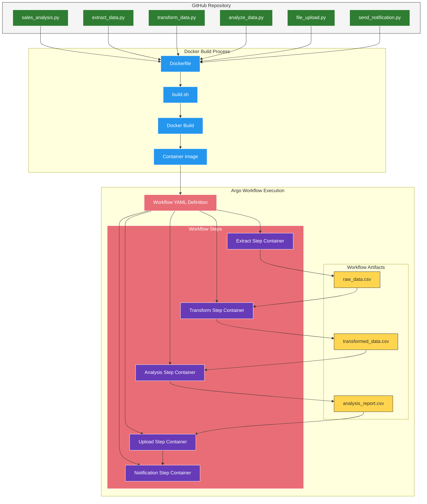

# Docker Build and Argo Workflow Execution Flow

This diagram illustrates how Python scripts are pulled from GitHub, packaged into a Docker image, and then executed as part of an Argo Workflow.



## Dynamic Script Loading Method

We can load Python scripts from GitHub in two ways:

### 1. Build-time Script Inclusion

```Dockerfile
FROM python:3.9-slim

WORKDIR /app

# Install git and dependencies
RUN apt-get update && apt-get install -y \
    git \
    && rm -rf /var/lib/apt/lists/*

# Install Python requirements
COPY requirements.txt .
RUN pip install --no-cache-dir -r requirements.txt

# Clone the repository to get the latest scripts
RUN git clone https://github.com/yourusername/sales-analysis.git /app/scripts

# Set the entrypoint
ENTRYPOINT ["python", "/app/scripts/main.py"]
```

### 2. Runtime Script Fetching

```Dockerfile
FROM python:3.9-slim

WORKDIR /app

# Install git and dependencies
RUN apt-get update && apt-get install -y \
    git \
    curl \
    && rm -rf /var/lib/apt/lists/*

# Install Python requirements
COPY requirements.txt .
RUN pip install --no-cache-dir -r requirements.txt

# Add script to fetch latest code at runtime
COPY fetch_scripts.sh /app/
RUN chmod +x /app/fetch_scripts.sh

# This script will fetch the latest code each time the container starts
ENTRYPOINT ["/app/fetch_scripts.sh"]
```

Where `fetch_scripts.sh` contains:

```bash
#!/bin/bash
# Fetch the latest scripts from GitHub
git clone https://github.com/yourusername/sales-analysis.git /app/scripts
# Execute the specified Python script with arguments
python /app/scripts/$1.py "${@:2}"
```

## Argo Workflow YAML Example

```yaml
apiVersion: argoproj.io/v1alpha1
kind: Workflow
metadata:
  name: sales-analysis-workflow
spec:
  entrypoint: sales-analysis
  templates:
  - name: sales-analysis
    dag:
      tasks:
      - name: extract
        template: extract-data
      - name: transform
        template: transform-data
        dependencies: [extract]
      - name: analyze
        template: analyze-data
        dependencies: [transform]
      - name: upload
        template: upload-data
        dependencies: [analyze]
      - name: notify
        template: send-notification
        dependencies: [upload]
        
  - name: extract-data
    container:
      image: sales-analysis:latest
      args: ["extract_data", "--source", "database", "--output", "/tmp/raw_data.csv"]
    outputs:
      artifacts:
      - name: raw-data
        path: /tmp/raw_data.csv
        
  - name: transform-data
    inputs:
      artifacts:
      - name: raw-data
        path: /tmp/raw_data.csv
    container:
      image: sales-analysis:latest
      args: ["transform_data", "--input", "/tmp/raw_data.csv", "--output", "/tmp/transformed_data.csv"]
    outputs:
      artifacts:
      - name: transformed-data
        path: /tmp/transformed_data.csv
        
  # Additional templates for analyze, upload, and notify steps
``` 