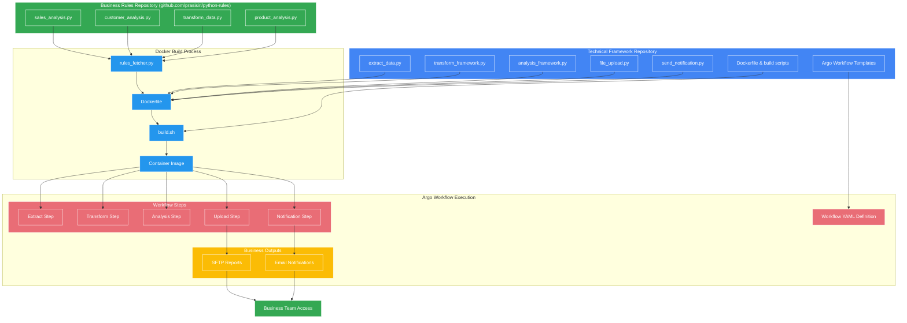

# Integrating Business Rules with Argo Workflows

This document explains how to separate business rules (owned by the business team) from the workflow execution framework (owned by the technical team).

## Architecture Overview



## Implementation Approach

### 1. Runtime Business Rules Fetcher

Create a Python script that fetches business rules at runtime:

```python
# rules_fetcher.py
import os
import subprocess
import importlib.util
import sys

def fetch_business_rules(rule_type):
    """
    Fetches and loads a business rule module from the business repository
    
    Args:
        rule_type: The type of rule to load (e.g., 'sales_analysis', 'customer_analysis')
    
    Returns:
        The loaded module containing the business rule
    """
    # Create directory for business rules if it doesn't exist
    rules_dir = "/app/business_rules"
    os.makedirs(rules_dir, exist_ok=True)
    
    # Clone or update the business rules repository
    repo_url = "https://github.com/prasisiri/python-rules.git"
    
    if not os.path.exists(f"{rules_dir}/.git"):
        # Initial clone
        subprocess.run(["git", "clone", repo_url, rules_dir], check=True)
    else:
        # Update existing repo
        subprocess.run(["git", "-C", rules_dir, "pull"], check=True)
    
    # Import the specific rule module dynamically
    module_path = f"{rules_dir}/{rule_type}.py"
    if not os.path.exists(module_path):
        raise FileNotFoundError(f"Business rule {rule_type}.py not found in repository")
    
    # Load the module
    spec = importlib.util.spec_from_file_location(rule_type, module_path)
    module = importlib.util.module_from_spec(spec)
    sys.modules[rule_type] = module
    spec.loader.exec_module(module)
    
    return module
```

### 2. Framework Wrapper Scripts

Create wrapper scripts that combine the technical framework with business rules:

```python
# analysis_framework.py
import os
import sys
import json
import pandas as pd
from rules_fetcher import fetch_business_rules

def run_analysis(analysis_type, input_file, output_file, parameters=None):
    """
    Run analysis by combining technical framework with business rules
    
    Args:
        analysis_type: Type of analysis ('sales', 'customer', 'product')
        input_file: Path to input data file
        output_file: Path to output results file
        parameters: Optional parameters as dictionary
    """
    # Load the appropriate business rule
    rule_module = fetch_business_rules(f"{analysis_type}_analysis")
    
    # Read the input data
    data = pd.read_csv(input_file)
    
    # Execute the business rule
    print(f"Executing {analysis_type} analysis using business rules...")
    
    if hasattr(rule_module, 'analyze_data'):
        # Standard interface for all rule modules
        results = rule_module.analyze_data(data, parameters)
    else:
        # Fallback for older rule modules
        results = rule_module.main(data, parameters)
        
    # Save the results
    if isinstance(results, pd.DataFrame):
        results.to_csv(output_file, index=False)
    else:
        # Handle non-DataFrame results
        with open(output_file, 'w') as f:
            json.dump(results, f)
            
    print(f"Analysis complete. Results saved to {output_file}")
    return output_file

if __name__ == "__main__":
    # Command line interface
    if len(sys.argv) < 4:
        print("Usage: python analysis_framework.py <analysis_type> <input_file> <output_file> [parameters]")
        sys.exit(1)
        
    analysis_type = sys.argv[1]
    input_file = sys.argv[2]
    output_file = sys.argv[3]
    
    # Parse optional parameters
    parameters = {}
    if len(sys.argv) > 4:
        parameters = json.loads(sys.argv[4])
        
    run_analysis(analysis_type, input_file, output_file, parameters)
```

### 3. Dockerfile to Build the Container

```Dockerfile
FROM python:3.9-slim

WORKDIR /app

# Install git and dependencies
RUN apt-get update && apt-get install -y \
    git \
    curl \
    && rm -rf /var/lib/apt/lists/*

# Install Python requirements
COPY requirements.txt .
RUN pip install --no-cache-dir -r requirements.txt

# Copy framework scripts (owned by technical team)
COPY rules_fetcher.py /app/
COPY analysis_framework.py /app/
COPY transform_framework.py /app/
COPY file_upload.py /app/
COPY send_notification.py /app/

# No need to copy business rules - they'll be fetched at runtime

# Create a simple entry script
RUN echo '#!/bin/bash\npython "$@"' > /app/entrypoint.sh && \
    chmod +x /app/entrypoint.sh

# Set the entrypoint
ENTRYPOINT ["/app/entrypoint.sh"]
```

### 4. Argo Workflow Definition

```yaml
apiVersion: argoproj.io/v1alpha1
kind: Workflow
metadata:
  name: business-rules-workflow
spec:
  entrypoint: main-workflow
  templates:
  - name: main-workflow
    dag:
      tasks:
      - name: extract
        template: extract-step
      - name: transform
        template: transform-step
        dependencies: [extract]
      - name: sales-analysis
        template: analysis-step
        arguments:
          parameters:
          - name: analysis-type
            value: sales
        dependencies: [transform]
      - name: customer-analysis
        template: analysis-step
        arguments:
          parameters:
          - name: analysis-type
            value: customer
        dependencies: [transform]
      - name: product-analysis
        template: analysis-step
        arguments:
          parameters:
          - name: analysis-type
            value: product
        dependencies: [transform]
      - name: upload-results
        template: upload-step
        dependencies: [sales-analysis, customer-analysis, product-analysis]
      - name: send-notification
        template: notify-step
        dependencies: [upload-results]
        
  - name: extract-step
    container:
      image: business-rules-workflow:latest
      args: ["extract_data.py", "--output", "/tmp/raw_data.csv"]
    outputs:
      artifacts:
      - name: raw-data
        path: /tmp/raw_data.csv
        
  - name: transform-step
    inputs:
      artifacts:
      - name: raw-data
        path: /tmp/raw_data.csv
    container:
      image: business-rules-workflow:latest
      args: ["transform_framework.py", "/tmp/raw_data.csv", "/tmp/transformed_data.csv"]
    outputs:
      artifacts:
      - name: transformed-data
        path: /tmp/transformed_data.csv
        
  - name: analysis-step
    inputs:
      artifacts:
      - name: transformed-data
        path: /tmp/transformed_data.csv
      parameters:
      - name: analysis-type
    container:
      image: business-rules-workflow:latest
      args: ["analysis_framework.py", "{{inputs.parameters.analysis-type}}", "/tmp/transformed_data.csv", "/tmp/{{inputs.parameters.analysis-type}}_report.csv"]
    outputs:
      artifacts:
      - name: analysis-report
        path: /tmp/{{inputs.parameters.analysis-type}}_report.csv
        
  - name: upload-step
    inputs:
      artifacts:
      - name: sales-report
        path: /tmp/sales_report.csv
      - name: customer-report
        path: /tmp/customer_report.csv
      - name: product-report
        path: /tmp/product_report.csv
    container:
      image: business-rules-workflow:latest
      args: ["file_upload.py", "--files", "/tmp/sales_report.csv,/tmp/customer_report.csv,/tmp/product_report.csv", "--destination", "sftp"]
        
  - name: notify-step
    container:
      image: business-rules-workflow:latest
      args: ["send_notification.py", "--subject", "Analysis Complete", "--message", "All analysis tasks have completed and reports are available on SFTP server"]
```

## Benefits of This Approach

1. **Clear Separation of Concerns**:
   - Business team owns and manages the business logic/rules
   - Technical team manages the execution framework and infrastructure

2. **Dynamic Updates**:
   - Business rules are fetched at runtime, allowing business team to update rules without requiring rebuilds
   - Latest rules are always used in the workflow

3. **Consistent Outputs**:
   - Reports are delivered to SFTP for business consumption
   - Email notifications keep business stakeholders informed

4. **Simplified Rule Management**:
   - Business team only needs to know Python, not Kubernetes/Argo/Docker
   - Rules repository is clean and focused on business logic only

5. **Scalable Architecture**:
   - Additional rule types can be added without changing the framework
   - Multiple rule versions can be supported through Git branching 