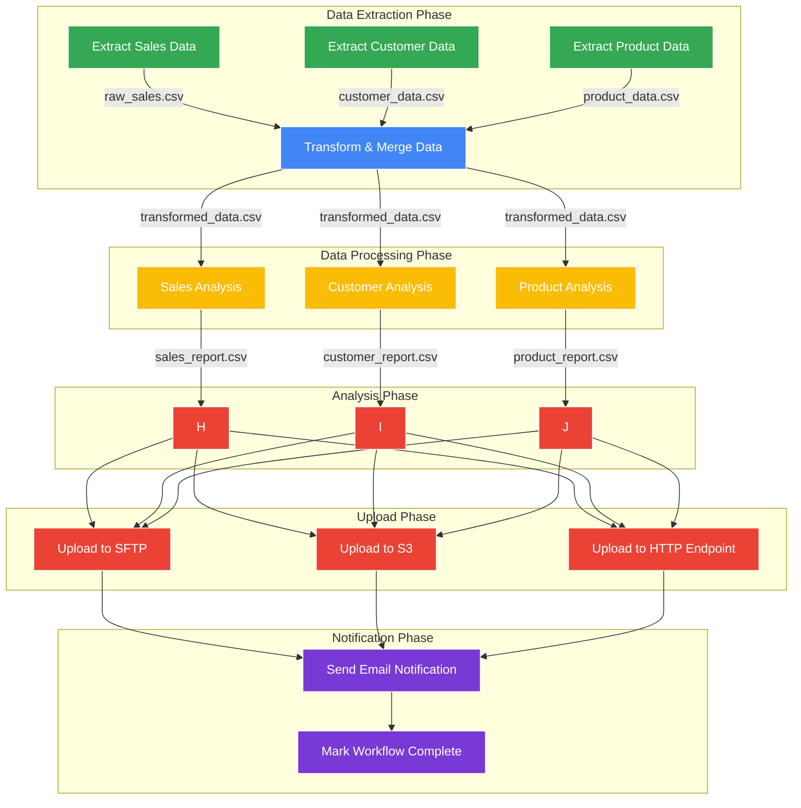

# Argo Workflows Architecture Diagram

The following diagram illustrates the typical workflow architecture for the sales analysis project using Argo Workflows.

## Key Features Highlighted

1. **Parallel Execution**: Extract jobs and analysis jobs run in parallel
2. **Dependencies**: Transform job depends on all extract jobs
3. **Data Flow**: Shows how data moves between workflow steps
4. **Multiple Upload Options**: SFTP, S3, and HTTP endpoints
5. **Notifications**: Final completion notification

## Implementation Details

Each box represents a container running a Python script that performs a specific function:

- **Extract Steps**: Pull data from various sources
- **Transform Step**: Clean, merge, and prepare data for analysis
- **Analysis Steps**: Perform business logic on prepared data
- **Upload Steps**: Transfer results to different storage systems
- **Notification Step**: Alert users when the workflow completes

The workflow definition in Argo allows these steps to be managed as a single entity, with automatic retry logic, dependency tracking, and artifact passing between steps. 